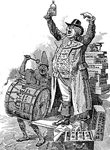
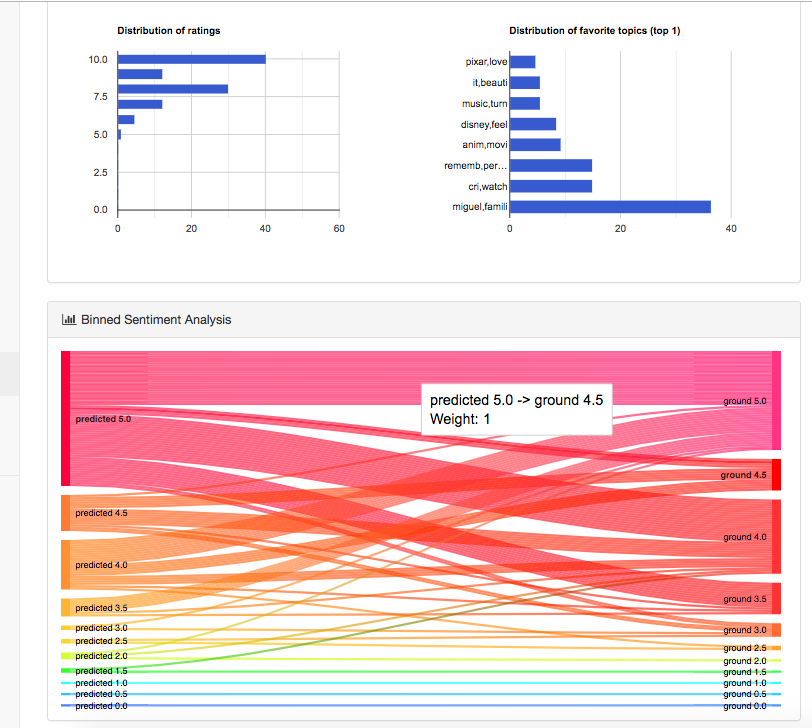
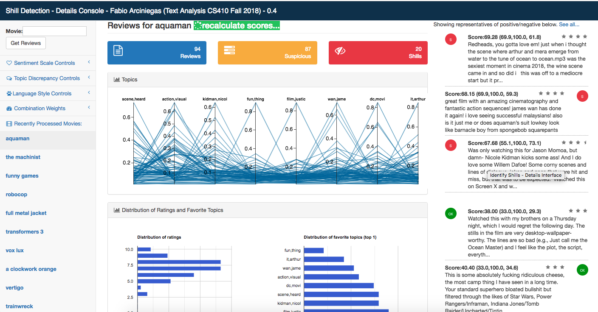
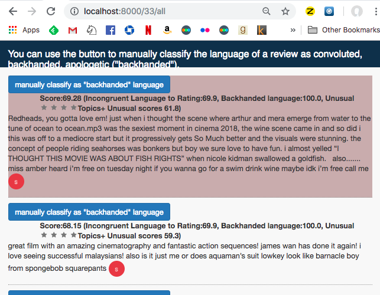

# Identify Shills 

**shill
noun.
    1. an accomplice of a hawker, gambler, or swindler who acts as an enthusiastic customer to entice or encourage others.**



This readme covers the documentation for the project, particularly the rationale, technologies, and formulas used as well as the installation of the project from scratch on your machine.

A separate document [tech_review.md](tech_review.md) captures what I hope are reusable lessons for others creating similar tools.

# Installation

The following instructions require a working version of python and virtualenv in a unix-like environment (Mac OS, linux, etc.).  Simply copy/paste the following on your terminal:

```
git clone git@gitlab.textdata.org:lfa2/cs410_final_project.git
cd cs410_final_project
virtualenv -p python3 cs410
source ./cs410/bin/activate 
pip install -r requirements.txt
cd shills
python manage.py runserver
```

After all packages are installed and the server started point your browser to http://localhost:8000/

# Usage

Simply enter the movie to be analyzed in the search box. See the accompanying video for a walkthrough of features: https://www.youtube.com/watch?v=gCZt6Mc0N6U

# The Shill problem


Sites like Goodreads or Letterboxd are based on reviews and while they have gotten better at detecting bots, the problem of shills is often not addressed satisfactorily because shills are often humans and the thresholds for hidindg reviews are too high. Sites are scared of angry feedback, and they might be slow waiting for items to be reported before hiding a review.

An end user of a site like goodreads (and this project) would like to have a much more aggressive stance than the site itself and doesn't want to wait until the site changes its policies to be closer to her own thresholds. She believes shills can be detected more efficiently than sites do and their reviews hidden with the click of a button.

Although in the traditional sense the motivation of the shill is financial, in this project we won't necessarily be able to identify _what_ the motivation is, yet we aim to identify the _probable existence_ of some motivation for ratings other than the reasons aduced in the text.


## Shills language doesn't match their predicted sentiment [SENTIMENT ANALYSIS]

Shills often point out issues with books to appear fair and balanced and yet give disproportionately high/low ratings. 

If a sentiment (scale) model can accurately predict star ratings for a large portion of the population, we could identify significant mismatches. e.g. If based on review text we predict a 3 stars rating but the user gave 5 star we can consider them candidates. 

In the system this is represented in a sankey diagram:


[1] Seeing stars: Exploiting class relationships for sentiment categorization with respect to rating scales http://www.cs.cornell.edu/home/llee/papers/pang-lee-stars.home.html 

[2] https://gengo.ai/datasets/15-free-sentiment-analysis-datasets-for-machine-learning/

[3] https://aws.amazon.com/getting-started/tutorials/analyze-sentiment-comprehend/


## Shill topics are often external to the thing reviewed [TOPIC ANALYSIS]

If the topics of a polarized review differ significantly from those of the rest of reviews we may hypothesize it could be evidence of bias and we have a candidate. (e.g. "person who wrote the book is my ex" → 0 stars)

In the system this is represented in parallel coordinates that highlight outliers clear and traditional distribution tables:




## Shills language is apologetical, backhanded [CLASSIFICATION]

Shill reviews often use apologetic language to backtrack in some way for the high review. 

```
“I have to admit that during the times that I wasn’t feeling whatever 
 intelligence the movie was pummeling out of me being actively insulted, 
 I did kind of enjoy the spectacle.” 
     — actual MSN review of Transformers 3
```
Note: for fun, see this brillant list of backhanded reviews of Transformers 3
https://www.vulture.com/2011/06/the_best_backhanded_compliment.html


In the system this is represented by an interface allowing the quick manual training of "backhanded" language:



# Heuristics to Scores
##  Strange Topics and Extreme Ratings simultaneously

 - zt: z-score of dominant topic  (how rare the topic is)
 - T_zt: threshold for zt's. z-score > T_zt → considered an outlier. 
   Default: 2 (empirically set)

 - zr: z-score of rating  (how rare the rating is)
 - T_zt: threshold for zr's. Default: 3 (standard)

 - heuristic 1: harmonic mean of normalized z-scores:
 
$$
H_1 = \frac{2(\frac{zt}{T_{zt}}\times\frac{zr}{T_{zr}})}{\frac{zt}{T_{zt}}+\frac{zr}{T_{zr}}}
$$

Note: zr/T_zt and zt/T_zt clipped at 1.0

## Language doesn't predict sentiment

Naturally, it can be bad prediction :) But assume it isn't (and feel free to adjust weights)
 
  -gb: ground bin (0-10)
  -pb: predicted bin (0-10)

$$
 H_2 = 100 (1-e^{-.4\mid gb-pb\mid})
$$
 
# Heuristics to Scores

## Language classified as "backhanded"
 
  - w_b : user-specified weight for result of bayes classifier
  
$$
 H_3 = 100 * w_b * ("backhanded" → 1, "ok" → 0)
$$
 
## A combination of the factors above

The ultimate output of the tool, per review, is a shill score that combines the factors above given user-controlled weights:

$$
 final = H_1*w_1 + H_2*w_2 + H_3*w_3 
$$


# Evolution of the project

## AWS Comprehend Discarded and other lessons

The original intention of using a only serverless AWS lambda functions was abandoned as the scope of the project grew beyond a simple sentiment analyis in AWS comprehend and also as it became clear that scraping and evaluating thousands of reviews with the current pricing by Amazon was cost-prohibitive. This and other lessons learned during development are fleshed out in a separate document [tech_review.md](tech_review.md) but there are two important things to mention in this main page:

## Shill says... *Caveat Emptor!*

Some modifications of the code are available but not recommended:

 - *Reduction/Removal of sleep time between scraping calls might result in IP being banned by the movie service*
 - *Replacing the default Textblob with AWS calls is trivial but would incur monetary costs*

## Full history in Git

Every feature of the system was created within the https://guides.github.com/introduction/flow/ style (meaning every feature has a clear issue and branch) and you can see the whole history of the project in https://gitlab.textdata.org/lfa2/cs410_final_project/branches and https://gitlab.textdata.org/lfa2/cs410_final_project/graphs/master/charts

# The bottomline - Minimum Goals (exceeded) and release @ December 15, 2018 (20:49:16) 
The minimum functionality aimed at was a system capturing an approximation of three heuristics above for a given review. That goal was significantly exceeded by a fully functional and customizable application that maintains and updates scores across arbitrary numbers of films and reviews.

